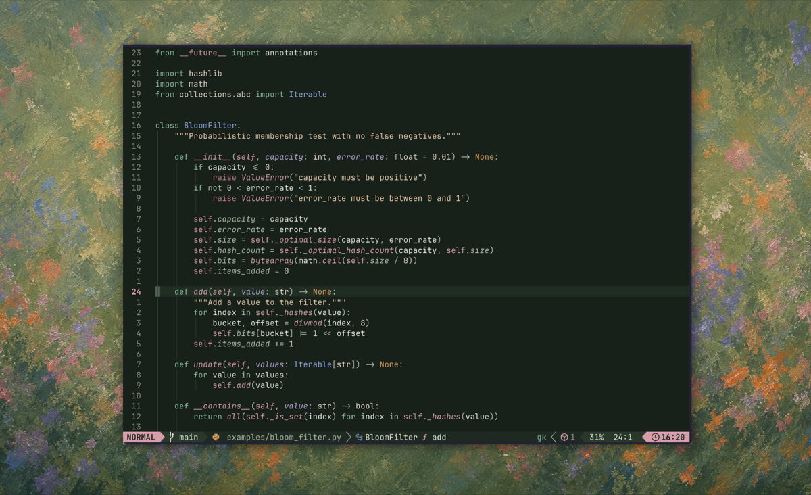

<p align="center">
    <h2 align="center">superbloom</h2>
</p>

<p align="center">Green Neovim colorscheme inspired by the California superbloom</p>



## LazyVim

In `~/.config/nvim/lua/plugins/superbloom.lua`:

```lua
return {
  {
    "jasonherngwang/superbloom.nvim",
    name = "superbloom",
    lazy = false,
    priority = 1000,
  },

  {
    "LazyVim/LazyVim",
    opts = {
      colorscheme = "superbloom",
    },
  },
}
```

In Neovim, run:

```vim
:Lazy sync
```

Restart Neovim, or load the colorscheme directly:

```vim
:colorscheme superbloom
```

If editing, reload the theme after local edits:

```vim
:SuperbloomReload
```
