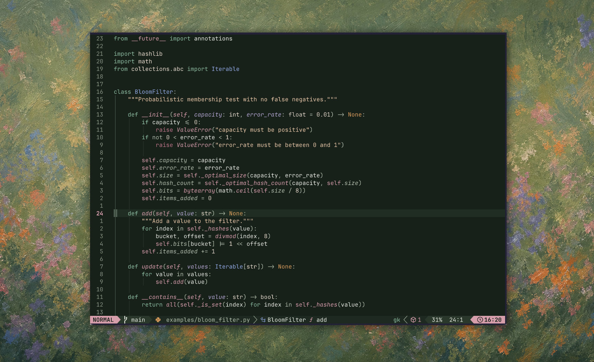

<p align="center">
    <h2 align="center">superbloom</h2>
</p>

<p align="center">Dark green colorscheme inspired by the California wildflowers</p>



## LazyVim

In `~/.config/nvim/lua/plugins/superbloom.lua`:

```lua
return {
  {
    "jasonherngwang/superbloom",
    name = "superbloom",
    lazy = false,
    priority = 1000,
  },

  {
    "LazyVim/LazyVim",
    opts = {
      colorscheme = "superbloom",
    },
  },
}
```

In Neovim, run:

```vim
:Lazy sync
```

Restart Neovim, or load the colorscheme directly:

```vim
:colorscheme superbloom
```

If editing, reload the theme after local edits:

```vim
:SuperbloomReload
```

## Ghostty

A matching [Ghostty](https://ghostty.org) terminal theme lives in [`ghostty/superbloom`](ghostty/superbloom).

Copy it into Ghostty's themes directory:

```sh
mkdir -p ~/.config/ghostty/themes
cp ghostty/superbloom ~/.config/ghostty/themes/superbloom
```

Then set it in `~/.config/ghostty/config`:

```
theme = superbloom
```

Reload Ghostty's config.

## Starship

A [Starship](https://starship.rs) palette + opinionated minimal prompt is in [`starship/superbloom.toml`](starship/superbloom.toml).

### Just the colors

To recolor your existing prompt without changing its layout, add the palette to `~/.config/starship.toml` and select it:

```toml
palette = "superbloom"

[palettes.superbloom]
base = '#142018'
surface = '#1b2a20'
overlay = '#26382b'
muted = '#81917d'
subtle = '#adbaa6'
text = '#e5eadf'
poppy = '#e69a4f'
gold = '#e2c583'
cream = '#e6d8c8'
sage = '#92ad8b'
sea = '#9ac6a6'
phacelia = '#7fbf9e'
sky = '#8fbfdc'
brodiaea = '#88a9e6'
lupine = '#b6a6d5'
clarkia = '#e09aaa'
paintbrush = '#c96f8d'
```

Then reference the flower names in your module styles, e.g. `style = "fg:phacelia"`.

### The full prompt

To also use the minimal prompt (full path, git branch, and `❯`), copy the whole file. This replaces your prompt layout, and needs a [Nerd Font](https://www.nerdfonts.com) for the branch and read-only glyphs:

```sh
cp starship/superbloom.toml ~/.config/starship.toml
```
